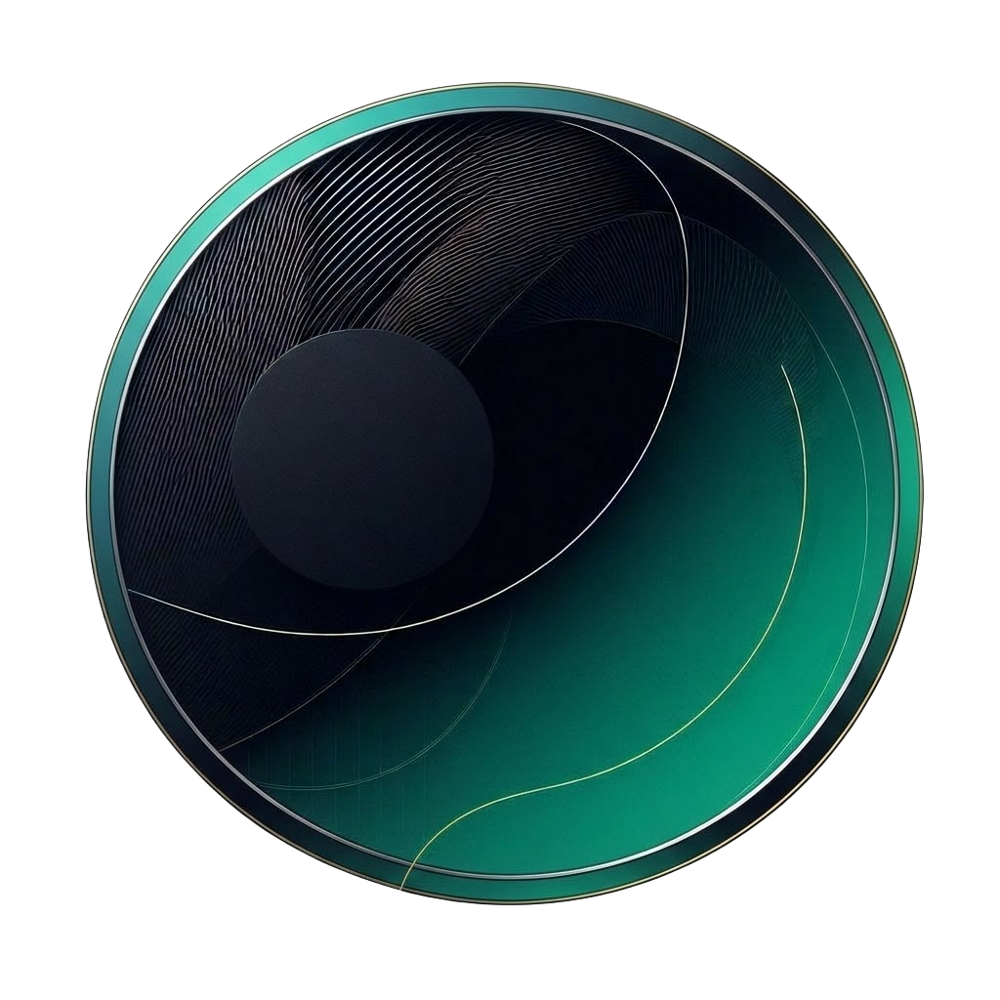

<p align="center">
  
</p>

<h1 align="center">Portafolio — José Antonio</h1>

<p align="center">
  <strong>Ingeniero de Software · Backend · Android · DevOps</strong>
</p>

<p align="center">
  <a href="https://josephantonydev.github.io/Portafolio-V2/">
    
  </a>
  <a href="https://github.com/JosephAntonyDev">
    
  </a>
  <a href="https://www.linkedin.com/in/jos%C3%A9-antonio-pinto-aguilar-12b0b1252/">
    
  </a>
</p>

---

## ✨ Descripción

Sitio web de portafolio personal desarrollado desde cero con **HTML, CSS y JavaScript puro** — sin frameworks. Presenta mi perfil profesional, habilidades técnicas, proyectos destacados y un formulario de contacto funcional.

Diseño oscuro moderno con acentos en verde teal (`#1cb698`), animaciones fluidas, transiciones premium y soporte completo responsive para desktop, tablet y móvil.

---

## 🖥️ Secciones

| Sección | Descripción |
|---------|-------------|
| **Inicio** | Hero con foto de perfil, título y redes sociales |
| **Quien Soy** | Sobre mí, intereses y soft skills |
| **Skills** | Tech Stack organizado por categorías (Backend, Frontend, DevOps, etc.) |
| **Curriculum** | Educación, experiencia y enlace a CV descargable |
| **Portafolio** | Proyectos web y Android con modales detallados y galerías interactivas |
| **Contacto** | Formulario funcional con toast de confirmación |

---

## 🚀 Proyectos Destacados

### Apps Web
| Proyecto | Descripción |
|----------|-------------|
| **Notaría 178** | Plataforma de gestión operativa con VPN Tailscale y control de acceso |
| **Vixel** | Plataforma descentralizada de juegos y torneos en Blockchain Vara — 🏆 1er Lugar Nacional |
| **VaultDoc-VD** | Gestión segura de archivos gubernamentales con análisis de vulnerabilidades |
| **GEOVA** | Sistema IoT de medición para ingeniería civil con Raspberry Pi y ESP32 |
| **Frimeet** | Motor de recomendaciones con Machine Learning y base de datos híbrida |
| **Encriptador** | Herramienta de encriptación de texto — Oracle ONE |

### Apps Android
| Proyecto | Descripción |
|----------|-------------|
| **SplitMeet** | App nativa en Kotlin con Jetpack Compose, MVVM y Dagger Hilt |
| **WireChef API** | Backend en Go con WebSockets en tiempo real para gestión de restaurante |
| **TodoSuper** | App de tareas con Clean Architecture consumiendo Todoist API |

---

## 🛠️ Tech Stack (del sitio)

```
HTML5 · CSS3 · JavaScript (ES6+)
```

| Categoría | Detalle |
|-----------|---------|
| **Estructura** | HTML5 semántico, secciones modulares cargadas dinámicamente |
| **Estilos** | CSS puro con variables, gradientes, glassmorphism, grid y flexbox |
| **Scripts** | JS vanilla modularizado (`app.js`, `portfolio.js`, `contacto.js`, etc.) |
| **Iconos** | Font Awesome 6.4.2 |
| **Hosting** | GitHub Pages con dominio personalizado |

---

## 📁 Estructura del Proyecto

```
├── index.html               # Shell principal
├── CNAME                     # Dominio personalizado
├── main.js                   # Backup del JS original
├── css/
│   ├── base/reset.css        # Reset CSS
│   ├── components/           # Navbar, botones
│   ├── sections/             # Estilos por sección
│   └── responsive.css        # Media queries globales
├── html/sections/            # Partials HTML cargados dinámicamente
├── js/
│   ├── app.js                # Loader de secciones
│   ├── menu.js               # Menú responsive
│   ├── portfolio.js          # Cards, modal, galería, lightbox
│   ├── portfolio-data.js     # Datos de todos los proyectos
│   ├── contacto.js           # Formulario de contacto
│   ├── toast.js              # Notificaciones toast
│   └── utils.js              # Utilidades compartidas
├── img/                      # Imágenes organizadas por sección
└── files/                    # CV descargable
```

---

## ⚡ Características Destacadas

- 🎨 **Diseño Dark Premium** — Gradientes, glassmorphism, bordes sutiles
- 📱 **100% Responsive** — Desktop, tablet y móvil con menú fullscreen
- 🖼️ **Galería Interactiva** — Carousel con thumbnails, lightbox fullscreen, navegación por teclado y swipe
- ✨ **Animaciones** — Transiciones CSS con cubic-bezier, fade-in staggered, hover effects
- 📂 **Código Modular** — HTML por secciones, JS por funcionalidad, CSS por componente
- 🔍 **Tabs de Portafolio** — Filtrado entre Apps Web y Apps Android
- 🌐 **Dominio Personalizado** — Desplegado en GitHub Pages

---

## 🏃 Ejecución Local

```bash
# Clonar el repositorio
git clone https://github.com/JosephAntonyDev/Portafolio-V2.git
cd Portafolio-V2

# Servir con cualquier servidor estático
python -m http.server 8080
# Abrir http://localhost:8080
```

---

<p align="center">
  Hecho con 💚 por <a href="https://github.com/JosephAntonyDev">José Antonio</a>
</p>
